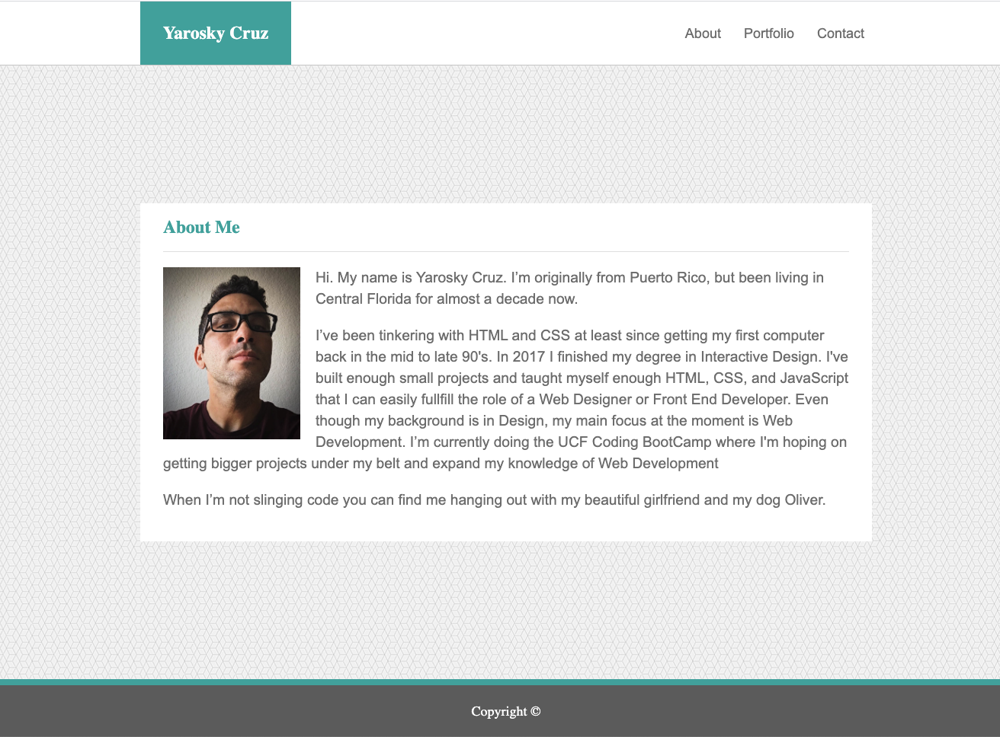

# Responsive Portfolio / [Demo](https://yarocruz.github.io/responsive-portfolio) 



## Description

This is the [bootstraped](https://getbootstrap.com/) version of the [barebones portoflio site](https://github.com/yarocruz/portfolio). The purpose of this project was to brush up on responsive design by using media queries and tools like [Bootstrap's grid system](https://getbootstrap.com/docs/4.4/layout/grid/). Another reason for the project is to have somewhere I can point to potential employers while I'm completing the [UCF Coding Bootcamp](https://bootcamp.ce.ucf.edu/coding/). While I do have a [Github Page](https://yarocruz.github.io/) where people can learn a bit about me, I don't have at the moment a proper portfolio. 

## Technologies

Built with plain ol' HTML and CSS, but the main focus was to use [Bootstrap](https://getbootstrap.com/). Media queries were added accordingly to make website responsive. Used he grid system with containers, rows, and columns to layout the pages. Used components like navs, card components for the portfolio page, and the form group components to build out the form. Used very minimal media queries since the grid system took care for most of the responsive behaviour. 

## Problems / Solutions

One of the biggest issues I had with this project was finding a good solution for making the footer stay at the bottom. Since there isn't enough content to push it down, my first attempt was to to use fixed positioning, but that created issues in mobile view. I ended up googling and found a good solution on [Stack Overflow](https://stackoverflow.com/questions/50429737/sticky-footer-with-flexbox)

```
.main-wrap {
	display: flex;
	flex-direction: column;
	min-height: 100vh;
	justify-content: space-between;
}
```
Since it only has three main div's this solution I think works the best. 

## Demo

See live demo [here](https://yarocruz.github.io/responsive-portfolio/)

## License 

[MIT](/LICENSE)

Feel free to clone this repo and modify as you wish.